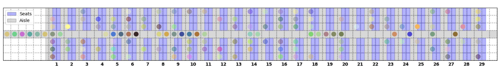
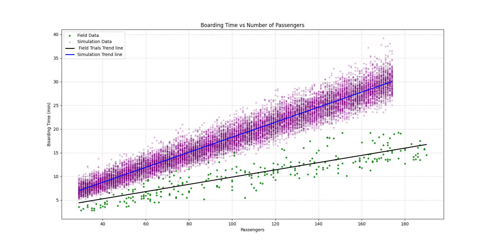
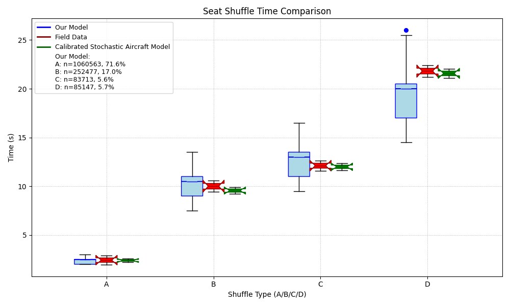
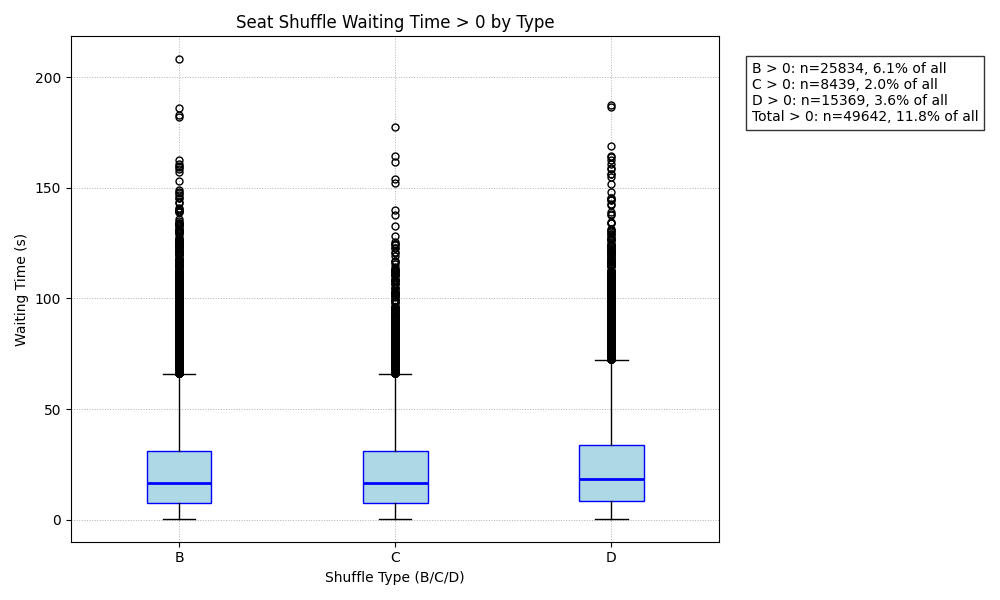

# Airplane Boarding Model
Project Computational Science [5062PRCS6Y] - Project Team 5

## Description
This model is an extentsion of the calibrated stochastic aircraft model of Schultz (2018).

This extension models the seat shuffling in an agent-based way (see Animations.md).


## Visualization



## Results

### Validation






### Experiment


## Installation

To install the dependencies use pip and the requirements.txt in this directory:

```
    $ pip install -r requirements.txt
```

## How to run interactive server

To launch the interactive server:

```
    $ solara run app.py
```

## How to collect the results

### Validation

To collect the results for the validation plots:

```
    $ python batch_run_validation.py
```

Validation results are outputted to a csv file in results/validation folder.

### Experiment

To collect the results for the experiment plots:

```
    $ python batch_run_experiment.py
```

Experiment results are outputted to a csv file in results/experiment folder.

## How to plot the results

### Validation

To plot the validation results:

```
    $ python analysis_validation.py
```

Validation plot images are saved in results/validation folder.

To plot the experiment results:

```
    $ python analysis_experiment.py
```

### Experiment

Experiment plot image is saved in results/validation folder.

## How to run tests

```
    $ python -m unittest discover -v tests
```

## References

- Michael Schultz.
Field trial measurements to validate a stochastic aircraft boarding model.
Aerospace, 5:27, March 2018.
- Michael Schultz, Thomas Kunze, and Hartmut Fricke.
Boarding on the critical path of the turnaround.
Proceedings of the 10th USA/Europe Air Traffic Management Research and Development Seminar, ATM 2013, June 2013.
- Michael Schultz, Christian Schulz, and Hartmut Fricke.
Efficiency of aircraft boarding procedures.
ICRAT - International Conference on Research in Airport Transportation, June 2008.